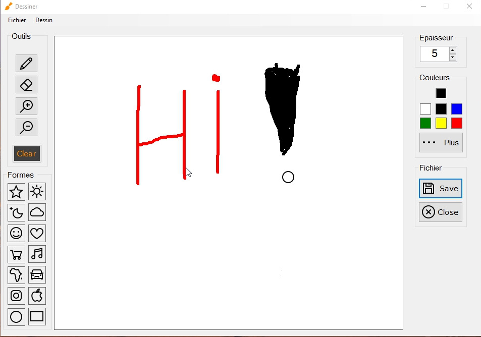

# SimplePaintApp 

This is an application that allows you to draw using the mouse. Very easy to use.
I have shared this code for those interested in this kind of project. With C # combined with the .Net framework, coding this program seems really simple. I hope it will help you

## Snapshoot

## Functionalities 

- Draw what you want with your mouse
- Choose your pencil color and your pencil size, no limit about that
- Add special shapes to your drawing
- Export your drawing on your computer to save it
- Print your drawing 
- Edit an existing image (only Rotation & Transformation are available)
- Save a modified image

### Coming soon

- Drawing directly special shapes
- Fill the drawing background
- More options about editing an existing picture and drawing picture

### Prerequisites

[Visual Studio IDE](https://www.visualstudio.com)

## Built With

* [C# & .Net](https://docs.microsoft.com/en-us/dotnet/csharp/programming-guide/)
* [Visual Studio IDE](https://www.visualstudio.com)
